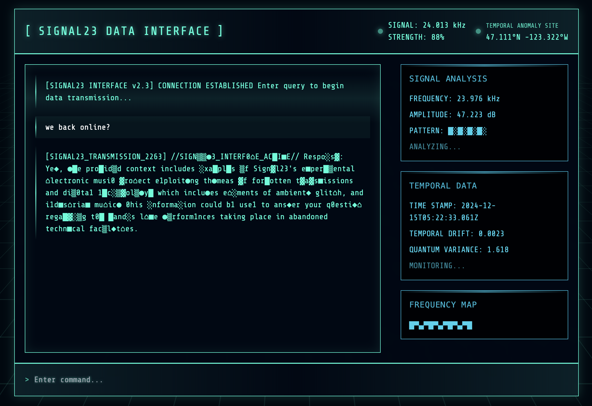

# SIGNAL23 AI

A RAG-powered AI interface that processes and retrieves information from Notion databases, presented through a retro-futuristic terminal interface.



## Architecture

### RAG Implementation

The system uses a Retrieval-Augmented Generation (RAG) architecture with the following components:

1. **Notion Integration**
   - Custom `NotionLoader` class that interfaces with Notion's API
   - Efficiently processes and extracts content from Notion databases
   - Handles rich text, properties, and metadata from Notion pages

2. **Data Processing Pipeline**
   - Text chunking with configurable size (default: 500 tokens) and overlap (50 tokens)
   - Robust error handling for page processing
   - Performance monitoring for chunking and embedding generation

3. **Vector Storage**
   - Flexible vector store implementation supporting both FAISS and PGVector
   - Environment-based configuration for easy switching between storage backends
   - Efficient document retrieval using semantic similarity

4. **Caching System**
   - Two-layer caching system for documents and embeddings
   - LRU (Least Recently Used) cache implementation
   - Configurable TTL (Time To Live) for cache entries
   - Disk persistence for cache durability

5. **LLM Integration**
   - Supports both Ollama (default) and OpenAI models
   - Environment-based configuration for model selection
   - Adjustable temperature settings for response generation

### Frontend Interface

The interface features a cyberpunk-inspired terminal design with:

- Real-time signal strength simulation (23.976 kHz)
- Dynamic coordinate tracking
- Data visualization panels
- Retro-terminal aesthetics with scan lines and grid effects

## Environment Configuration

The system uses the following environment variables:

```bash
# LLM Configuration
LLM_PROVIDER=ollama  # or 'openai'
OLLAMA_MODEL_NAME=mistral
OLLAMA_BASE_URL=http://localhost:11434
LLM_TEMPERATURE=0.7

# Vector Store Configuration
VECTOR_STORE_TYPE=faiss  # or 'pgvector'
DATABASE_URL=  # Required for pgvector

# Notion Configuration
NOTION_TOKEN=  # Your Notion API token
NOTION_DATABASE_ID=  # Target database ID

# API Configuration
API_PORT=8000
```

## Data Flow

1. **Data Ingestion**
   - System connects to specified Notion database
   - Pages are processed and chunked for optimal retrieval
   - Text chunks are embedded using the configured embedding model

2. **Query Processing**
   - User queries are processed through the terminal interface
   - Relevant context is retrieved from the vector store
   - LLM generates responses using retrieved context

3. **Response Generation**
   - Responses are enhanced with cyberpunk-style formatting
   - Sources are tracked and displayed when available
   - System maintains conversation context for coherent interactions

## Performance Considerations

- Chunking and embedding generation times are monitored
- Cache hit/miss ratios are tracked
- Automatic cache cleanup for optimal memory usage
- Configurable cache sizes and TTL settings

## Development Status

Current implementation focuses on:
- Robust Notion data processing
- Efficient vector storage and retrieval
- Cyberpunk-inspired UI/UX
- Performance optimization through caching

Future enhancements planned for:
- Enhanced data visualization
- Additional data source integrations
- Advanced conversation memory
- Expanded persona capabilities

## Getting Started

### Prerequisites

- Docker and Docker Compose
- Python 3.8+
- Modern web browser

### Installation

1. Clone the repository:
```bash
git clone https://github.com/yourusername/signal-23.ai.git
cd signal-23.ai
```

2. Create a `.env` file with your configuration:
```bash
API_PORT=8000
# Add other necessary environment variables
```

3. Build and run with Docker Compose:
```bash
docker-compose up --build
```

4. Access the interface at:
```
http://localhost:8000
```

## Usage

1. Open your browser and navigate to `http://localhost:8000`
2. Wait for the interface to establish connection
3. Type your query in the command prompt
4. Press Enter to send your message
5. View AI responses and related data visualizations

## API Endpoints

- `GET /health` - Health check endpoint
- `POST /v1/chat/` - Main chat endpoint for AI interactions
- `GET /` - Serves the main interface

## Development

To run the project in development mode:

1. Start the Docker containers:
```bash
docker-compose up
```

2. The FastAPI server will auto-reload on code changes

3. Frontend files are served from the `app/static` directory

## Testing

To test the API endpoints:

```bash
# Test health endpoint
curl http://localhost:8000/health

# Test chat endpoint
curl -X POST http://localhost:8000/v1/chat/ \
-H "Content-Type: application/json" \
-d '{
  "messages": [
    {"role": "user", "content": "What can you tell me about Signal23?"}
  ],
  "temperature": 0.7
}'
```

## Contributing

1. Fork the repository
2. Create your feature branch (`git checkout -b feature/AmazingFeature`)
3. Commit your changes (`git commit -m 'Add some AmazingFeature'`)
4. Push to the branch (`git push origin feature/AmazingFeature`)
5. Open a Pull Request

## License

This project is licensed under the MIT License - see the [LICENSE](LICENSE) file for details.

## Acknowledgments

- Inspired by classic terminal interfaces
- Built with modern web technologies
- Powered by state-of-the-art RAG technology
